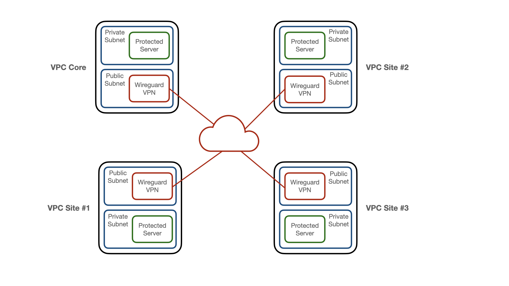

# Wireguard VPN Mesh

An example setup of a wireguard VPN mesh on AWS. Uses multiple VPCs as sites, traffic between
sites routed over wireguard in a fully connected mesh configuration.

Includes ssh configurations for local workstation to access all machines, and configs and keys on
each server to test interconnections.

The configuration here creates 4x VPCs and 8x EC2 servers. It uses `t2.micro` spot instances; it doesn't
cost a lot, but running it will incur costs.

[Terraform](https://www.terraform.io/) is used to create the infrastructure.

[Ansible](https://docs.ansible.com/ansible_community.html) is used to configure the servers.

## Network

The built network looks like this:

## Setup

### Configuration

Copy the `terraform.tfvars.example` to `terraform.tfvars` and fill in the variables with your 
custom values.

Create the private and public keys with the script `make-keys.sh`. An example run looks like 
this below (note that these don't work so don't try and just use them):

    $ ./make-keys.sh 4
    site: site0
        vpn_private_key = "GDuHtwb6NxSuyh5Jp+2kEQpLa4fAY1WOqvvatV0n9W0="
        vpn_public_key  = "Kx+tF0lHlYz8DV/wnmG5TUZPcB9ElL8vr0rIbI5sLCg="
    site: site1
        vpn_private_key = "oM3XFx/I0nW5N5pIC0UAjoqxFzSedVfzrmf0Faq0jH0="
        vpn_public_key  = "nd+ZjI7omhzAvElOIDQfh7Jxrct7bwWRqA7qQO3TL0M="
    site: site2
        vpn_private_key = "sIgJZJTBOb04+G7G5smjtRHdhPb0KlHDM5yZHcHY5FI="
        vpn_public_key  = "mtJ93WCkOOxWI8P1KmMIWZ0RIe3esJx8ydR4iuXTLjs="
    site: site3
        vpn_private_key = "eNpOBcpr2y3DoTgf8CyfKeIH3cQ4rDrvTcjSPzc8BHs="
        vpn_public_key  = "oL/f2YQN68NEtDtCXmpD90VLbbCO3SoMEaVK0YxC4nE="

Copy the keys into the terraform.tfvars file at the correct location.

### Build The Infrastructure

    terraform apply
    ./local/ansible/run-ansible.sh

### Tear It Down

    terraform destroy

## Using

There is an ssh-config file in `local/ssh.cfg`. To log into a server using it, run:

    ssh -F local/ssh.cfg site0-vpn

There is a `~/.ssh/config` file and key installed on each server for accessing servers
across the vpn mesh.

